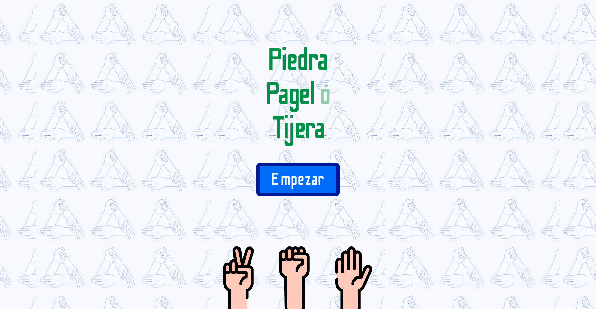

# Desafío APX School Nivel 2
## Imagen

## Descripción
Juego Piedra, Papel o Tijera en JavaScript con manejo de estados y eventos.
En este pequeño proyecto se utiliza localStorage para guardar el estado del juego.

## Tecnoogías
- HTML
- CSS
- TypeScript

## Aprendizaje
- Manejo de estados
- Manejo de eventos
- LocalStorage
- TypeScript

## Enlace a la página
[Piedra, Papel o Tijera](https://ppt-game.netlify.app/)